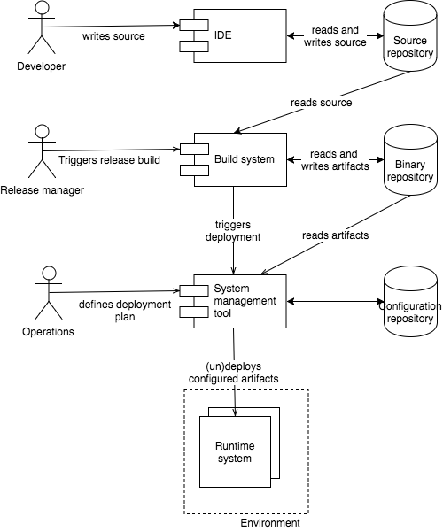

## Roles

Remember one person can have more than one role. In conventional companies each role is given to different persons in different business units.
In devops each team lives all those roles and thus takes responsibility over the whole development cycle.

Additionally in some cases the release build and deployment is automated to automatically bring changes into test and even production systems.

### Developer

Creates the software either by writing code or by visually designing processes. The result is some kind of code that can be executed or compiled to a deployable artifact.

### Release manager

Responsible for creating a release of source code that can be released to production or another stage where aproval is necessary.

### Administrator

Responsible for systems / software in a stage. Deploys and undeploys software and does the configuration.

## Repository

### Source Code Repository
Stores the source code and tracks changes and release versions

### Binary Repository
Stores the built artifacts that can be deployed to stages

### Configuration Repository
Stores configuration data. The configuration data can be general or cluster, server or artifact specific
