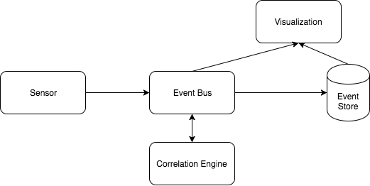

## Sensor

Hooks into a system that is to be monitored, captures events in the native
format of the system, optionally converts them to a generic event format and
sends them to the event bus.

## Event Bus

Distributes monitoring events. It should be an open system that is easy to
integrate with other systems like external system monitoring tools or
correlation engines

## Correlation Engine

Correlates events either only or by help of a persistent event store. It creates
higher level events out of low level events

## Event Store
Provides functionality to persist and retrieve events. It should also
automatically condense history information to avoid an overflow of data

## Visualization

Shows the events in a way the user can get the most information out of them.
For example the events can be shown on a graph of the systems or the business
process they are related to

## Applying the concept to ELK (Elastic Search, Logstash, Kibana)

Element | Maps to
--------|--------
Sensor | Logstash
EventBus | Not fully represented. Done in Logstash
Correlation Engine | Lucene as part of Elastic Search
EventStore | Elastic Search
Visualization | Kibana
